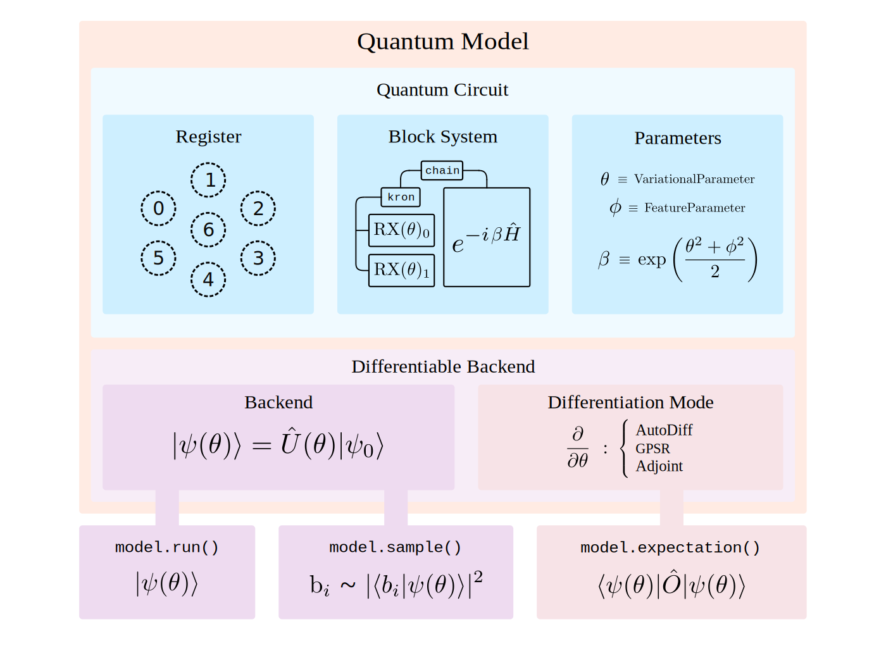

<p align="center">
  <picture>
    <source media="(prefers-color-scheme: dark)" srcset="./docs/extras/assets/logo/qadence_logo_white.svg" width="75%">
    <source media="(prefers-color-scheme: light)" srcset="./docs/extras/assets/logo/qadence_logo.svg" width="75%">
    
  </picture>
</p>

**Qadence** is a Python package that provides a simple interface to build **digital-analog quantum
programs** with tunable qubit interactions and arbitrary register topologies realizable on neutral atom devices.

**For a high-level overview of Qadence features, [check out our white paper](https://arxiv.org/abs/2401.09915).**

**For more detailed information, [check out the documentation](https://pasqal-io.github.io/qadence/latest/).**

[](https://github.com/pasqal-io/qadence/actions/workflows/lint.yml)
[](https://github.com/pasqal-io/qadence/actions/workflows/test_fast.yml)
[](https://pasqal-io.github.io/qadence/latest)
[](https://pypi.org/project/qadence/)
[](https://opensource.org/licenses/Apache-2.0)

## Feature highlights

<p align="center">
  <picture>
    <source media="(prefers-color-scheme: dark)" srcset="./docs/extras/assets/qadence_arch.svg" width="75%">
    <source media="(prefers-color-scheme: light)" srcset="./docs/extras/assets/qadence_arch.svg" width="75%">
    
  </picture>
<p align="center">

* A [block-based system](docs/content/block_system.md) for composing _**complex digital-analog
  programs**_ in a flexible and scalable manner, inspired by the Julia quantum SDK
  [Yao.jl](https://github.com/QuantumBFS/Yao.jl) and functional programming concepts.

* An intuitive [expression-based system](docs/content/parameters.md) developed on top of the symbolic library [Sympy](https://www.sympy.org/en/index.html) to construct _**parametric quantum programs**_ easily.

* Out-of-the-box _**automatic differentiability**_ of quantum programs with [PyTorch](https://pytorch.org/) integration.

* [High-order generalized parameter shift rules](docs/tutorials/advanced_tutorials/differentiability.md) for _**differentiating parametrized quantum operations**_.

* A [simple interface](docs/tutorials/digital_analog_qc/analog-basics.md) to work with _**interacting neutral-atom qubit systems**_
  using [arbitrary registers topologies](docs/content/register.md).

## Installation guide

Qadence is available on [PyPI](https://pypi.org/project/qadence/) and can be installed using `pip` as follows:

```bash
pip install qadence
```

The default, pre-installed backend for Qadence is [PyQTorch](https://github.com/pasqal-io/pyqtorch), a differentiable state vector simulator for digital-analog simulation based on `PyTorch`. It is possible to install additional, `PyTorch` -based backends and the circuit visualization library using the following extras:

* `visualization`: A visualization library to display quantum circuit diagrams.
* `protocols`: A collection of [protocols](https://github.com/pasqal-io/qadence-protocols) for error mitigation in Qadence.
* `libs`: A collection of [functionalities](https://github.com/pasqal-io/qadence-libs) for graph machine learning problems build on top of Qadence.
* `pulser`: The [Pulser](https://github.com/pasqal-io/Pulser) backend for composing, simulating and executing pulse sequences for neutral-atom quantum devices (experimental).

Qadence also supports a `JAX` engine which is currently supporting the [Horqrux](https://github.com/pasqal-io/horqrux) backend. `horqrux` is currently only available via the [low-level API](examples/backends/low_level/horqrux_backend.py).


To install individual extras, use the following syntax (**IMPORTANT** Make sure to use quotes):

```bash
pip install "qadence[pulser,visualization]"
```

To install all available extras, simply do:

```bash
pip install "qadence[all]"
```

**IMPORTANT**
Before installing `qadence` with the `visualization` extra, make sure to install the `graphviz` package
on your system:

```bash
# For Debian-based distributions (e.g. Debian, Ubuntu)
sudo apt install graphviz

# on MacOS
brew install graphviz

# via conda
conda install python-graphviz
```

On Windows Linux Subsystem (WSL2) it has been reported that in some cases "wslutilities" must be installed.
Please follow instructions [here](https://wslutiliti.es/wslu/install.html) for your flavour.
For example on Ubuntu 22.04 LTS and later you must run:
```
sudo add-apt-repository ppa:wslutilities/wslu
sudo apt update
sudo apt install wslu
```

## Contributing

Before making a contribution, please review our [code of conduct](docs/getting_started/CODE_OF_CONDUCT.md).

- **Submitting Issues:** To submit bug reports or feature requests, please use our [issue tracker](https://github.com/pasqal-io/qadence/issues).
- **Developing in qadence:** To learn more about how to develop within `qadence`, please refer to [contributing guidelines](docs/getting_started/CONTRIBUTING.md).

### Setting up qadence in development mode

We recommend to use the [`hatch`](https://hatch.pypa.io/latest/) environment manager to install `qadence` from source:

```bash
python -m pip install hatch

# get into a shell with all the dependencies
python -m hatch shell

# run a command within the virtual environment with all the dependencies
python -m hatch run python my_script.py
```

**WARNING**
`hatch` will not combine nicely with other environment managers such as Conda. If you still want to use Conda,
install it from source using `pip`:

```bash
# within the Conda environment
python -m pip install -e .
```

Users also report problems running Hatch on Windows, we suggest using WSL2.

## Citation

If you use Qadence for a publication, we kindly ask you to cite our work using the following BibTex entry:

```latex
@article{qadence2024pasqal,
  title = {Qadence: a differentiable interface for digital-analog programs.},
  author={Dominik Seitz and Niklas Heim and João P. Moutinho and Roland Guichard and Vytautas Abramavicius and Aleksander Wennersteen and Gert-Jan Both and Anton Quelle and Caroline de Groot and Gergana V. Velikova and Vincent E. Elfving and Mario Dagrada},
  journal={arXiv:2401.09915},
  url = {https://github.com/pasqal-io/qadence},
  year = {2024}
}
```

## License
Qadence is a free and open source software package, released under the Apache License, Version 2.0.
